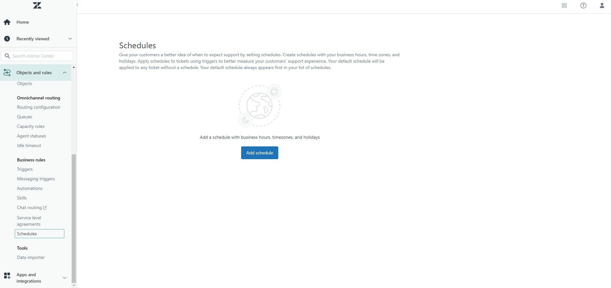
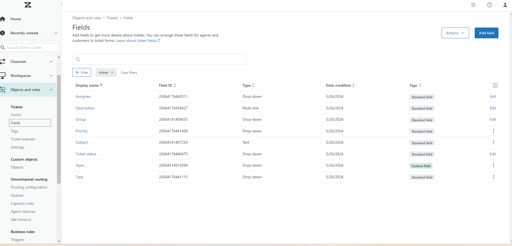
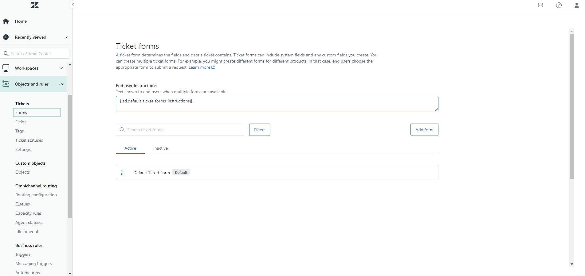
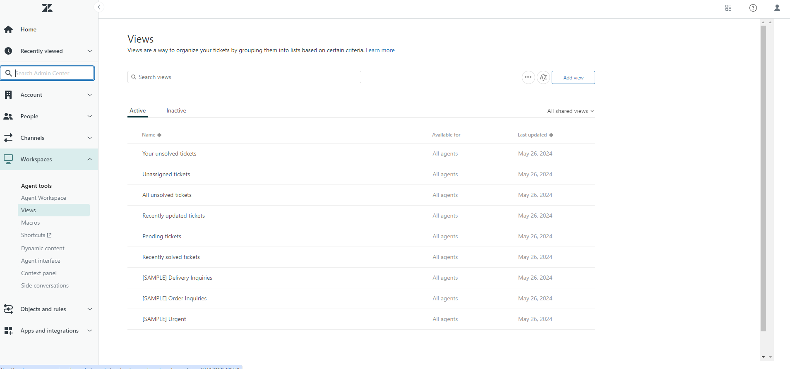
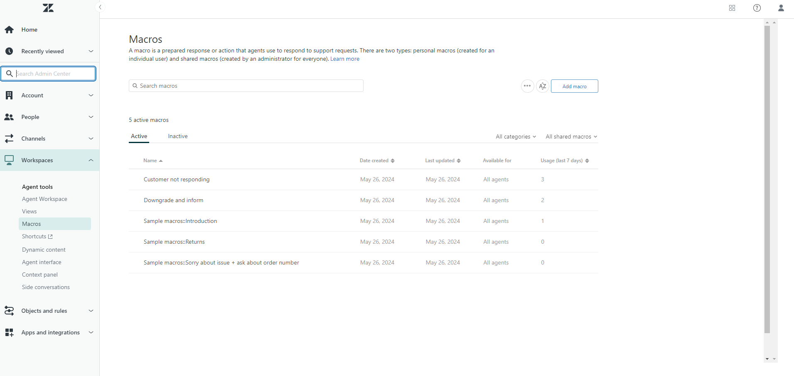
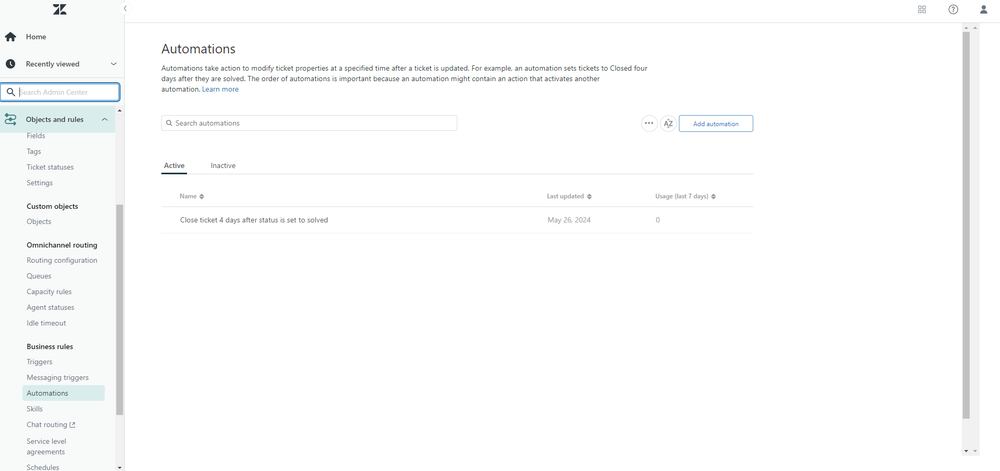
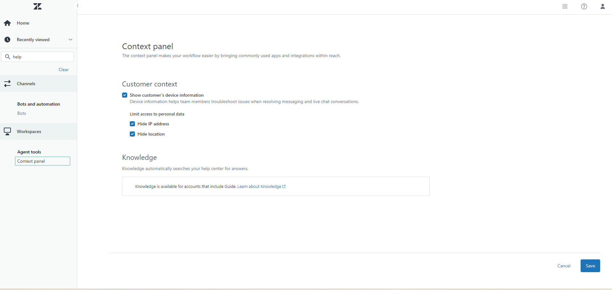
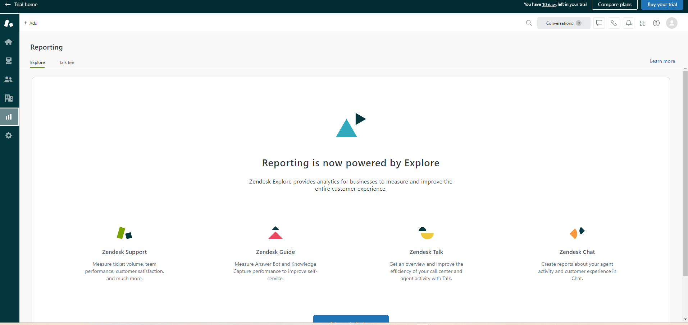

# Zendesk Helpdesk Ticketing System Setup

## Project Overview
This project demonstrates the setup and configuration of a Zendesk helpdesk ticketing system. It includes detailed steps for setting up various components of Zendesk, such as support email, business hours, custom ticket fields, forms, views, macros, triggers, automations, and the customer portal. Additionally, this project provides documentation of common helpdesk issues and their resolutions.

## Table of Contents
- [Project Setup](#project-setup)
- [Support Email Setup](#support-email-setup)
- [Business Hours and SLA](#business-hours-and-sla)
- [Custom Ticket Fields](#custom-ticket-fields)
- [Ticket Forms](#ticket-forms)
- [Ticket Views](#ticket-views)
- [Macros](#macros)
- [Triggers](#triggers)
- [Automations](#automations)
- [Customer Portal](#customer-portal)
- [Reporting and Analytics](#reporting-and-analytics)
- [Common Issues and Resolutions](#common-issues-and-resolutions)
- [Password Reset](#password-reset)
- [Software Installation](#software-installation)
- [Project Reflection](#project-reflection)
- [How to Contribute](#how-to-contribute)
- [License](#license)

## Project Setup
Include the initial setup steps here.

## Support Email Setup
1. Log in to your Zendesk account.
2. Click on the settings cog on the left taskbar.
3. Select **Go to Admin Center**.
4. Under **Channels**, select **Email**.
5. Add your support email address.
6. Verify the email address and complete the setup.

## Business Hours and SLA
1. Click on the settings cog on the left taskbar.
2. Select **Go to Admin Center**.
3. Under **Objects and rules**, expand the **Business rules** category.
4. Under **Business rules**, select **Schedules**.
5. Set up your business hours and define SLAs based on your support policies.

## Custom Ticket Fields
1. Click on the settings cog on the left taskbar.
2. Select **Go to Admin Center**.
3. Under **Objects and rules**, expand the **Tickets** category.
4. Under **Tickets**, select **Fields**.
5. Create custom fields that suit your helpdesk needs.

## Ticket Forms
1. Click on the settings cog on the left taskbar.
2. Select **Go to Admin Center**.
3. Under **Objects and rules**, expand the **Tickets** category.
4. Under **Tickets**, select **Forms**.
5. Create forms tailored to different types of issues.

## Ticket Views
1. Click on the settings cog on the left taskbar.
2. Select **Go to Admin Center**.
3. Under **Workspaces**, expand the **Agent tools** category.
4. Under **Agent tools**, select **Views**.
5. Configure views to organize and prioritize tickets.

## Macros
1. Click on the settings cog on the left taskbar.
2. Select **Go to Admin Center**.
3. Under **Workspaces**, expand the **Agent tools** category.
4. Under **Agent tools**, select **Macros**.
5. Create macros for common responses and actions.

## Triggers
1. Click on the settings cog on the left taskbar.
2. Select **Go to Admin Center**.
3. Under **Objects and rules**, expand the **Business rules** category.
4. Under **Business rules**, select **Triggers**.
5. Set up triggers to automate actions based on ticket conditions.

## Automations
1. Click on the settings cog on the left taskbar.
2. Select **Go to Admin Center**.
3. Under **Objects and rules**, expand the **Business rules** category.
4. Under **Business rules**, select **Automations**.
5. Configure automations to streamline ticket workflows.

## Customer Portal
1. Click on the settings cog on the left taskbar.
2. Select **Go to Admin Center**.
3. Under **Channels**, select **Help Center**.
4. Customize the portal and add FAQs and knowledge base articles.

## Reporting and Analytics
1. On the main overview outside of the Admin Center, click on the **Reporting** tab on the left taskbar.
2. Generate and customize reports to track KPIs.

## Common Issues and Resolutions
For common issues and resolutions, please refer to our dedicated repository:
[Common Issues Repository](https://github.com/your-organization/common-issues)

This repository contains comprehensive documentation on troubleshooting common problems encountered. It includes detailed guides, step-by-step instructions, and solutions to common issues such as:

- Password reset procedures
- Software installation problems
- Network connectivity issues
- Email configuration issues
### Password Reset
1. Verify the user's identity.
2. Guide the user to the password reset page.
3. Instruct the user to enter their email address and follow the prompts.
4. If the user does not receive the reset email, check the spam/junk folder.
5. Ensure that the user's account is active and not locked.

### Software Installation
1. Verify the software requirements and compatibility.
2. Provide the user with installation files or download links.
3. Guide the user through the installation process.
4. Troubleshoot any errors during installation by referring to common error messages and solutions.

### Network Connectivity Problems 
1. **Establish Communication:**
   - Initiate a call or video chat with the user.
   - Utilize screen-sharing software for visual assistance.

2. **Gather Information:**
   - Ask the user to describe the issue in detail.
   - Inquire about any error messages and when the problem started.

3. **Verify Physical Connections:**
   - Instruct the user to check cable connections.
   - Guide them through restarting modem/router and device.

4. **Check Network Settings:**
   - Walk the user through checking Wi-Fi and IP settings.

5. **Perform Remote Diagnostics:**
   - Use remote access software for troubleshooting.

6. **Guide Through Basic Troubleshooting:**
   - Provide step-by-step instructions for restarting equipment and resetting network settings.

7. **Verify Firewall and Security Software:**
   - Advise the user to temporarily disable firewall/security software if necessary.

8. **Update Network Drivers:**
   - Instruct the user to check for and install updates for network drivers.

9. **Document Steps Taken:**
   - Keep detailed notes of troubleshooting steps and outcomes.
   
10. **Escalate if Necessary:**
    - If the issue persists, escalate to higher-level support or ISP.
    - Provide contact information for further assistance.

### Email Configuration Issues
1. Verify the correct email server settings (IMAP/POP3, SMTP).
2. Ensure the user's email credentials are correct.
3. Guide the user through configuring their email client with the correct settings.
4. Troubleshoot any email delivery issues by checking email server logs.

## Conclusion

Implementing a Zendesk helpdesk ticketing system offers numerous benefits to organizations seeking to streamline their customer support processes and enhance the overall customer experience. Through the setup and configuration outlined in this project, we've demonstrated how Zendesk can be effectively utilized to address a wide range of support needs, from managing support email and defining business hours to automating ticket workflows and providing self-service options through the customer portal.

By leveraging Zendesk's powerful features and capabilities, organizations can:

- **Improve Efficiency**: Zendesk's automation tools enable support teams to work more efficiently by automating repetitive tasks and routing tickets to the appropriate agents.
- **Enhance Customer Satisfaction**: With customizable ticket forms, views, and macros, organizations can ensure that support requests are handled promptly and effectively, leading to higher levels of customer satisfaction.
- **Gain Insights**: Through reporting and analytics, organizations can gain valuable insights into support performance, identify areas for improvement, and make data-driven decisions to enhance the overall support experience.
- **Promote Self-Service**: The customer portal and knowledge base empower customers to find answers to their questions independently, reducing the need for agent intervention and improving customer empowerment.
- **Ensure Consistency**: With standardized processes for ticket management, including triggers, automations, and macros, organizations can maintain consistency in their support interactions, regardless of the volume of incoming requests.

Overall, the Zendesk Helpdesk Ticketing System project provides a comprehensive guide for organizations looking to implement or optimize their customer support operations. By following the steps outlined in this project and leveraging Zendesk's robust platform, organizations can deliver exceptional support experiences that drive customer satisfaction and loyalty.

Thank you for joining us on this journey to explore the capabilities of Zendesk and discover how it can transform your customer support operations.

## License
This project is licensed under the MIT License - see the [LICENSE](LICENSE) file for details.
