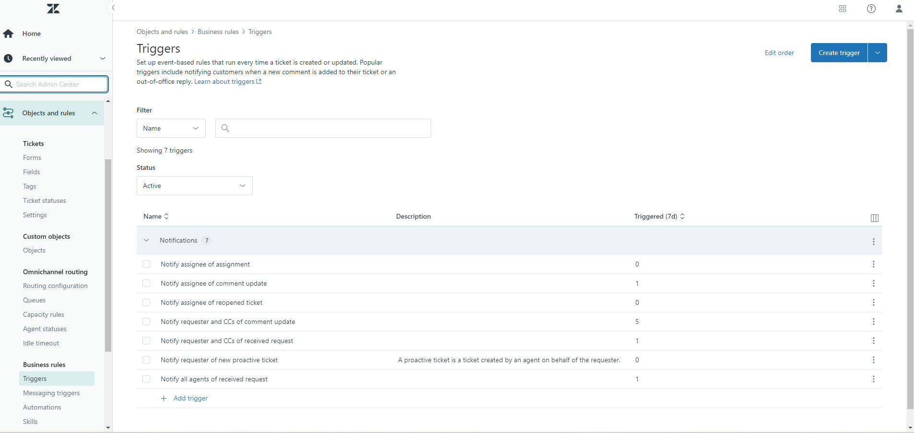

# Zendesk Helpdesk Ticketing System Setup

## Project Overview
This project demonstrates the setup and configuration of a Zendesk helpdesk ticketing system. It includes detailed steps for setting up various components of Zendesk, such as support email, business hours, custom ticket fields, forms, views, macros, triggers, automations, and the customer portal. Additionally, this project provides documentation of common helpdesk issues and their resolutions.

## Table of Contents
- [Support Email Setup](#support-email-setup)
- [Business Hours and SLA](#business-hours-and-sla)
- [Custom Ticket Fields](#custom-ticket-fields)
- [Ticket Forms](#ticket-forms)
- [Ticket Views](#ticket-views)
- [Macros](#macros)
- [Triggers](#triggers)
- [Automations](#automations)
- [Customer Portal](#customer-portal)
- [Reporting and Analytics](#reporting-and-analytics)
- [Common Issues and Resolutions](#common-issues-and-resolutions)
- [License](#license)

## Support Email Setup
1. Log in to your Zendesk account.
2. Click on the settings cog on the left taskbar.
3. Select **Go to Admin Center**.
4. Under **Channels**, select **Email**.
5. Add your support email address.
6. Verify the email address and complete the setup.

## Business Hours and SLA
1. Click on the settings cog on the left taskbar.
2. Select **Go to Admin Center**.
3. Under **Objects and rules**, expand the **Business rules** category.
4. Under **Business rules**, select **Schedules**.
5. Set up your business hours and define SLAs based on your support policies.

## Custom Ticket Fields
1. Click on the settings cog on the left taskbar.
2. Select **Go to Admin Center**.
3. Under **Objects and rules**, expand the **Tickets** category.
4. Under **Tickets**, select **Fields**.
5. Create custom fields that suit your helpdesk needs.

## Ticket Forms
1. Click on the settings cog on the left taskbar.
2. Select **Go to Admin Center**.
3. Under **Objects and rules**, expand the **Tickets** category.
4. Under **Tickets**, select **Forms**.
5. Create forms tailored to different types of issues.

## Ticket Views
1. Click on the settings cog on the left taskbar.
2. Select **Go to Admin Center**.
3. Under **Workspaces**, expand the **Agent tools** category.
4. Under **Agent tools**, select **Views**.
5. Configure views to organize and prioritize tickets.

## Macros
1. Click on the settings cog on the left taskbar.
2. Select **Go to Admin Center**.
3. Under **Workspaces**, expand the **Agent tools** category.
4. Under **Agent tools**, select **Macros**.
5. Create macros for common responses and actions.

## Triggers
1. Click on the settings cog on the left taskbar.
2. Select **Go to Admin Center**.
3. Under **Objects and rules**, expand the **Business rules** category.
4. Under **Business rules**, select **Triggers**.
5. Set up triggers to automate actions based on ticket conditions.

## Automations
1. Click on the settings cog on the left taskbar.
2. Select **Go to Admin Center**.
3. Under **Objects and rules**, expand the **Business rules** category.
4. Under **Business rules**, select **Automations**.
5. Configure automations to streamline ticket workflows.

## Customer Portal
1. Click on the settings cog on the left taskbar.
2. Select **Go to Admin Center**.
3. Under **Channels**, select **Help Center**.
4. Customize the portal and add FAQs and knowledge base articles.

## Reporting and Analytics
1. On the main overview outside of the Admin Center, click on the **Reporting** tab on the left taskbar.
2. Generate and customize reports to track KPIs.

## Common Issues and Resolutions
For common issues and resolutions, please refer to our dedicated repository:
[Common Issues Repository](Common%20Issues%20Repository.md)

This repository contains comprehensive documentation on troubleshooting common problems encountered. It includes detailed guides, step-by-step instructions, and solutions to common issues such as:

- Password reset procedures
- Software installation problems
- Network connectivity issues
- Email configuration issues

## Conclusion

Implementing a Zendesk helpdesk ticketing system offers numerous benefits to organizations seeking to streamline their customer support processes and enhance the overall customer experience. Through the setup and configuration outlined in this project, I've demonstrated how Zendesk can be effectively utilized to address a wide range of support needs, from managing support email and defining business hours to automating ticket workflows and providing self-service options through the customer portal.

By leveraging Zendesk's powerful features and capabilities, organizations can:

- **Improve Efficiency**: Zendesk's automation tools enable support teams to work more efficiently by automating repetitive tasks and routing tickets to the appropriate agents.
- **Enhance Customer Satisfaction**: With customizable ticket forms, views, and macros, organizations can ensure that support requests are handled promptly and effectively, leading to higher levels of customer satisfaction.
- **Gain Insights**: Through reporting and analytics, organizations can gain valuable insights into support performance, identify areas for improvement, and make data-driven decisions to enhance the overall support experience.
- **Promote Self-Service**: The customer portal and knowledge base empower customers to find answers to their questions independently, reducing the need for agent intervention and improving customer empowerment.
- **Ensure Consistency**: With standardized processes for ticket management, including triggers, automations, and macros, organizations can maintain consistency in their support interactions, regardless of the volume of incoming requests.

## License
This project is licensed under the MIT License - see the [LICENSE](LICENSE) file for details.
